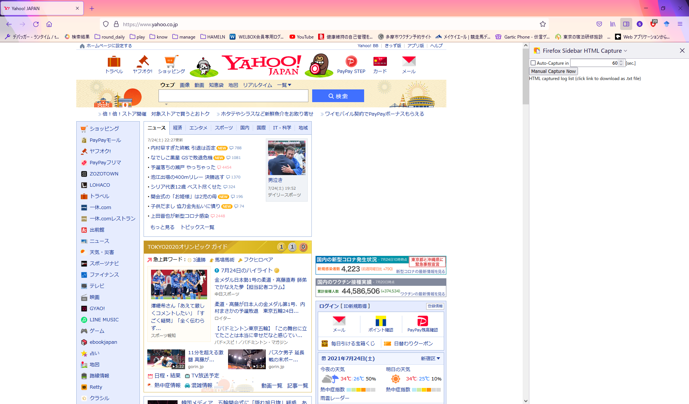
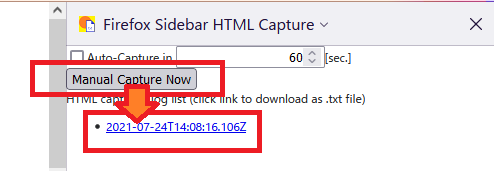
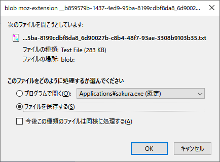
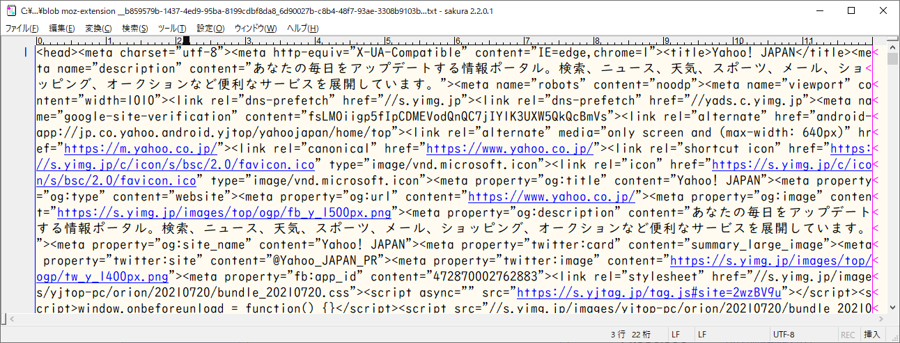
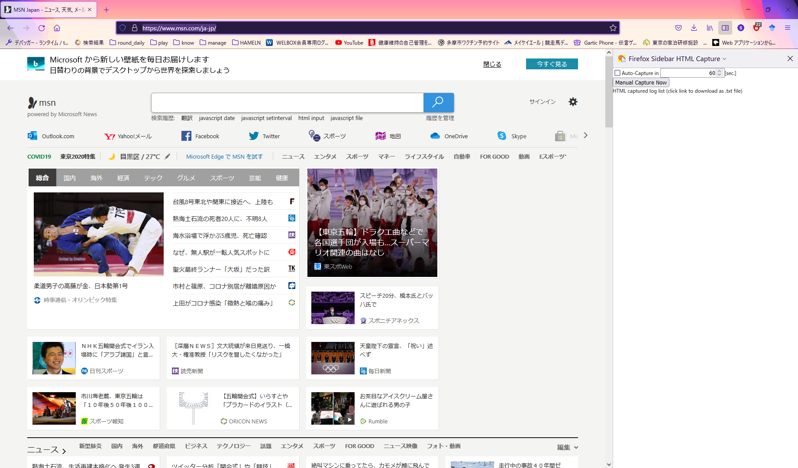
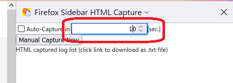
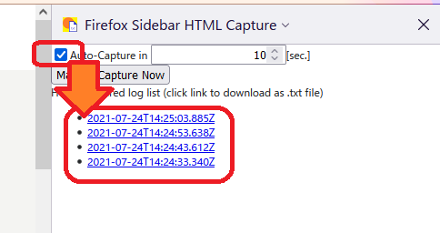
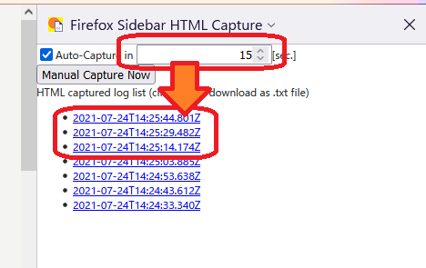
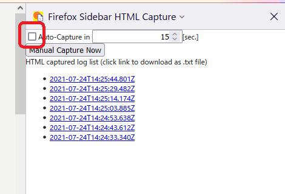

# firefox-sidebar-html-capture

This is a tool that captures displayed web pages into text files.
You can use it to debug dynamically changing web pages.
You can also use it to create web page support tool.

表示されたWebページを テキストファイルに キャプチャするツールです。
動的に変更されるWebページのデバッグに使えます。
また、webページをサポートするツールの作成にも使えます。

## Support Language

Sidebar can support only English.
This manual can supprot English and Japanese.

ツールは英語だけサポートします。
本マニュアルは英語・日本語で書きますので頑張ってください。

## Usage

### Usage 1 : Capture web page manually （手作業でキャプチャしたい場合）

1. sample capture image is from https://www.yahoo.co.jp/ in Jul 24, 2021.  
  yahooで説明します。  
  
1. Click "Manual Capture Now" button to capture web page, and you can obtain Timestamp List.  
   サイドバー上部の "Manual Capture Now" ボタンをクリックすると、タイムスタンプのリストが出ます。  
   
1. Click Timestamp Link in "HTML capture log list" section, and you can download some .txt file.  
   タイムスタンプのリストをクリックすると、テキストファイルをダウンロードできます。  
   
1. downloaded some .txt file is what you want to capture HTML file.  
   ダウンロードしたテキストが、キャプチャしたHTMLファイルです。  
   

### Usage 2 : Capture web page automatically ( periodically ) （自動で周期実行でキャプチャしたい場合）

1. sample capture image is from https://www.msn.com/ja-jp/ in Jul 24, 2021.  
  msnで説明します。  
  
1. Change "in XX [sec.]" to set capture period. default is 60 seconds.  
  サイドバー上部の数字を入れる部分が、キャプチャ周期です。  
  
1. Check "Auto-capture" to start capture.  
  サイドバー左上のチェックボックスにチェックを入れて、キャプチャ開始です。  
  
1. You can change capture period while auto-capture.  
  キャプチャ中にキャプチャ周期を変更できます。  
  
1. Clear "Auto-capture" to stop capture.  
  サイドバー左上のチェックボックスのチェックを外して、キャプチャ終了です。  
  
1. Click Timestamp Link and you can get .txt file same as manually capture case.  
   手作業のときと同様、タイムスタンプのリストをクリックすると、テキストファイルをダウンロードできます。

## Limitation （制限）

You can use only 1 tab when using firefox-sidebar-html-capture.

本ツール利用時は、タブ１個のみで作業してください。

## Report issue （問題を見つけた場合）

1. create Issue ticket in [this repository](https://github.com/stageleft/firefox-sidebar-html-capture).
2. mention to me in Twitter: [@elderalliance](https://twitter.com/elderalliance).

GitHubでチケット切ってください。その後、私のTwitterアカウントまでお知らせください。
